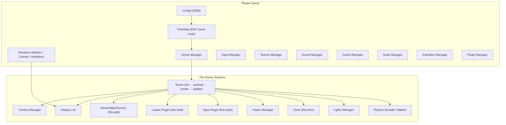
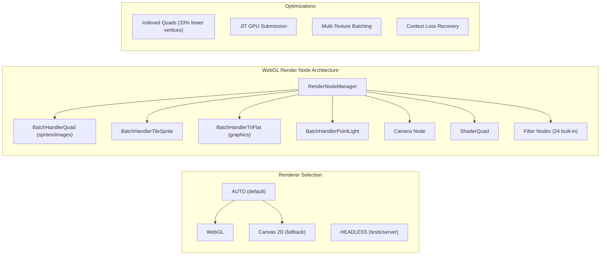

# Phaser: The Most Popular Open-Source 2D Web Game Framework

## Executive Summary

Phaser is the dominant open-source 2D game framework for web browsers, with **39,557 GitHub stars**, **7,135 forks**, **~597K npm downloads/month**, and over **13 years of continuous development** since its first commit in April 2013[^1]. Created by Richard Davey (`photonstorm`) and now commercially backed by **Phaser Studio Inc** (funded by a **$2M seed from Open Core Ventures**)[^2], Phaser 4 — released April 10, 2026 — represents a complete renderer rewrite introducing a node-based WebGL architecture capable of rendering **1 million+ sprites in a single draw call**[^3]. Among full-featured 2D game frameworks (physics, audio, input, tilemaps, scene management), Phaser has no close rival in community size, feature completeness, or ecosystem breadth. Its only star-count superior is PixiJS (47K stars), which is a rendering engine — not a complete game framework[^4].

---

## Table of Contents

1. [History & Governance](#1-history--governance)
2. [Architecture Overview](#2-architecture-overview)
3. [Core Subsystems Deep Dive](#3-core-subsystems-deep-dive)
4. [Phaser 4 New Features](#4-phaser-4-new-features)
5. [Ecosystem & Community](#5-ecosystem--community)
6. [Competitive Landscape](#6-competitive-landscape)
7. [Getting Started](#7-getting-started)
8. [v3 → v4 Migration](#8-v3--v4-migration)
9. [Performance Characteristics](#9-performance-characteristics)
10. [Key Repositories Summary](#10-key-repositories-summary)
11. [Confidence Assessment](#11-confidence-assessment)

---

## 1. History & Governance

### Timeline

| Date | Milestone |
|---|---|
| **2011** | Richard Davey begins internal R&D (pre-public)[^5] |
| **April 12, 2013** | First commit pushed to GitHub[^6] |
| **September 2013** | **Phaser 1.0.0** released[^7] |
| **February 2014** | **Phaser 2.0.0** released[^8] |
| **2017** | Phaser 2.6.2 final; community forks as **Phaser CE** (`phaserjs/phaser-ce`)[^9] |
| **February 2018** | **Phaser 3.0.0** — complete ground-up rewrite[^10] |
| **April 2023** | Phaser 3.60 "Miku" — FX system, 70× mobile perf improvement[^11] |
| **October 2023** | **Phaser Studio Inc** formed, OCV $2M seed investment[^2] |
| **May 2025** | Phaser 3.90 "Tsugumi" — final v3 release[^12] |
| **April 10, 2026** | **Phaser 4.0.0 "Caladan"** — complete renderer rewrite[^13] |
| **April 30, 2026** | **Phaser 4.1.0 "Salusa"** — current latest release[^14] |

> **Naming convention**: Phaser 3 releases use anime character names (Miku, Tsugumi, Hanabi). Phaser 4 uses sci-fi/Dune universe names (Caladan, Salusa)[^13].

### Governance

Phaser operates under a **BDFL (Benevolent Dictator For Life)** model. Richard Davey is sole architect and decision-maker[^15]. Contributions are welcome but strictly scoped — the CONTRIBUTING.md explicitly states: *"Coding style preferences are not contributions"*[^15]. All PRs must pass ESLint. GitHub Issues are reserved for bugs only; general support goes through the Phaser Forum[^15].

### Commercial Model

**Open-core**: the framework is MIT-licensed; revenue comes from the commercial **Phaser Editor** IDE ($12/month)[^16].

| Revenue Stream | Description |
|---|---|
| Phaser Editor IDE | $12/mo subscription (visual scene editor, physics tools, asset management)[^16] |
| Enterprise tier | Custom pricing — seat management, SSO, priority support[^16] |
| OCV Investment | $2M seed from Open Core Ventures (GitLab co-founder Sid Sijbrandij)[^2] |
| Patreon/GitHub Sponsors | Community donations[^17] |

### Key People

| Person | Role |
|---|---|
| **Richard Davey** (`photonstorm`) | Creator, CTO of Phaser Studio Inc[^2] |
| **Ben Richards** (`BenjaminDRichards`) | Core engineer — active daily on v4 development[^18] |
| **@samme** | Prolific community contributor — credited in nearly every v3 release[^19] |
| **RexRainbow** | Author of 200+ community plugins[^20] |

---

## 2. Architecture Overview

### High-Level Architecture



### Namespace Structure

The framework exposes a single `Phaser` namespace with 25+ sub-namespaces[^21]:

```
Phaser
├── Actions            — Bulk operations on arrays of GameObjects
├── Animations         — AnimationManager, Animation, AnimationState
├── BlendModes         — 27 blend mode constants
├── Cache              — CacheManager (multi-typed asset store)
├── Cameras            — Camera, CameraManager, camera effects
├── Core               — Game, Config, TimeStep, CreateRenderer
├── Curves             — Bezier, Line, Spline, Ellipse paths
├── Data               — DataManager (per-object key/value store)
├── Display            — Canvas pool, color utilities, masks
├── Events             — EventEmitter (wraps eventemitter3)
├── Filters            — 24 built-in post-processing filters (v4)
├── GameObjects        — All display objects (Sprite, Image, Text, etc.)
├── Geom               — Circle, Ellipse, Line, Point, Polygon, Rectangle
├── Input              — Keyboard, Mouse, Touch, Pointer, Gamepad
├── Loader             — LoaderPlugin + 30+ file type loaders
├── Math               — Vectors, easing, angles, fuzzy math, noise
├── Physics            — Arcade + Matter.js (both integrated)
├── Plugins            — Global/Scene plugin system
├── Renderer           — WebGL + Canvas renderers, render nodes
├── Scale              — ScaleManager (responsive sizing)
├── Scene/Scenes       — Scene, SceneManager, lifecycle management
├── Sound              — WebAudio, HTML5Audio, NoAudio backends
├── Structs            — List, Map, ProcessQueue, RTree, Set, Stack
├── Textures           — TextureManager, Texture, Frame, atlas parsing
├── Tilemaps           — Tilemap, TilemapLayer, TilemapGPULayer
├── Time               — Clock, TimerEvent
├── TintModes          — MULTIPLY, FILL, ADD, SCREEN, OVERLAY, HARD_LIGHT
├── Tweens             — TweenManager, Tween builders
└── Utils              — Array, Object, String, NOOP utilities
```

### Build Artifacts

| Build | Format | Size (gzip) |
|---|---|---|
| `phaser.min.js` | UMD | **345 KB**[^22] |
| `phaser-arcade.min.js` | UMD (no Matter.js) | 313 KB[^22] |
| `phaser.esm.min.js` | ESM | Same content[^22] |
| `phaser.js` | UMD (with JSDoc) | 8.23 MB[^22] |

Single runtime dependency: `eventemitter3 ^5.0.4`[^14].

---

## 3. Core Subsystems Deep Dive

### 3.1 Rendering Pipeline

Phaser 4's renderer is a **complete rewrite** from v3, replacing the pipeline-based system with a **node-based architecture**[^23].



**Key architectural details**[^23]:
- **Indexed quad rendering**: 4 vertices per quad (6 indices), reducing vertex upload by 33% vs v3
- **JIT GPU submission**: nothing goes to GPU until the batch is full or a break is forced
- **Multi-texture batching**: avoids unnecessary batch breaks, especially on mobile
- **Batch capacity**: 16,384 quads per draw call[^24]
- **DrawingContext pool**: reuses framebuffer/texture resources
- **ProgramManager**: compiles, caches, and reuses GLSL programs[^24]

### 3.2 Physics Engines

Two completely separate physics systems ship in the full build[^25]:

#### Arcade Physics
Fast, lightweight AABB-based physics in `src/physics/arcade/`[^25]:
- **World.js** (93 KB): gravity, step, collisions, R-tree broad-phase
- **Body.js** (82 KB): velocity, acceleration, drag, bounce, mass
- AABB only — rectangles and circles
- Tilemap collision with angle slopes
- Separate build available: `phaser-arcade-physics.min.js` (313 KB gzip)

#### Matter.js
Full rigid-body dynamics in `src/physics/matter-js/`[^25]:
- Rotation, compound bodies, constraints, springs, joints
- Concave polygon support via poly-decomp
- Ragdolls, rope physics, soft body simulation
- PhysicsEditor import for custom shapes
- Mouse drag constraints via `PointerConstraint`

#### Box2D v3 (Official Plugin)
A new official companion package — `phaserjs/phaser-box2d` (151★)[^26]:
- Pure JS conversion of Box2D v3 (released August 2024) — **< 70 KB min+gz**
- Soft Step Solver for superior stability
- Capsule bodies (new primitive shape type)
- Continuous Collision Detection (CCD)
- Works client-side or server-side
- Phaser integration helpers: `SpriteToBox()`, `AddSpriteToWorld()`, `UpdateWorldSprites()`[^26]

### 3.3 Audio System

Three backends with a common API in `src/sound/`[^27]:

| Backend | When Used |
|---|---|
| `WebAudioSoundManager` | Primary — Web Audio API |
| `HTML5AudioSoundManager` | Fallback — `<audio>` elements |
| `NoAudioSoundManager` | Stub when audio unavailable |

Features: audio sprites, looping, playback rate, detune, spatial/positional audio, dynamic volume/mute[^27].

### 3.4 Input System

Unified abstraction across all pointer types in `src/input/`[^28]:

- **InputPlugin** (114 KB): per-scene hit testing, event dispatch, interactive objects
- **Pointer** (40 KB): unified mouse/touch/stylus state — up to 10 simultaneous touch points
- **Keyboard**: `KeyboardPlugin`, `Key`, `KeyCodes`, key combos
- **Gamepad**: `GamepadPlugin`, `Gamepad`, `Button`, `Axis`
- **Pixel-perfect hit detection**: reads alpha channel[^28]
- **Drag/drop** built-in
- **Camera-aware**: each camera can block input for underlying cameras

### 3.5 Scene Management

Scene lifecycle in `src/scene/`[^29]:

```
BOOT → INIT → START → RUNNING ⇄ PAUSED / SLEEPING → SHUTDOWN → DESTROYED
```

- Multiple scenes run simultaneously (layerable, z-ordered)
- Sleeping scenes freeze update but still render
- Each scene automatically receives injected systems: `this.add`, `this.load`, `this.input`, `this.physics`, `this.cameras`, `this.tweens`, `this.time`, `this.sound`, `this.data`[^29]

### 3.6 Tilemap System

Three rendering paths in `src/tilemaps/`[^30]:

| Component | Description |
|---|---|
| `TilemapLayer` | CPU-rendered, culled, supports collisions + physics |
| `TilemapGPULayer` | Single-draw-call GPU layer — up to 4096×4096 tiles (v4 new)[^30] |
| `Tilemap` (114 KB) | Main API — layer management, tile manipulation |

Supports **Tiled** JSON, CSV, and Weltmeister formats. Features tile flip/rotate, animated tiles, collision shapes, and dynamic tile manipulation[^30].

### 3.7 Animation & Tween Systems

**Animations** (`src/animations/`)[^31]: Frame-based sprite sheet animations with global registry. Named animations defined once, played on any sprite. Supports repeat, yoyo, frameRate, duration, chaining, and JSON loading.

**Tweens** (`src/tweens/`)[^32]: Tweens any numeric property on any object. Supports chaining via `TweenChain`, all standard easing functions, yoyo, repeat, per-property callbacks.

### 3.8 Camera System

Multi-camera support in `src/cameras/2d/`[^33]:
- Multiple cameras per scene (split-screen)
- Camera culling, zoom, scroll, rotation
- Built-in effects: fade, flash, shake, pan-to, zoom-to, rotate-to
- Deadzone for follow targets with configurable lerp
- Scroll factor on game objects for parallax effects
- Filters applicable per camera (same filter system as game objects)

### 3.9 Scale Manager

Responsive canvas scaling in `src/scale/`[^34]:

| Mode | Behavior |
|---|---|
| `NONE` | No scaling |
| `FIT` | Letterbox — fit inside parent, preserve aspect ratio |
| `ENVELOP` | Cover parent, crop overflow |
| `RESIZE` | Fill all parent space |
| `EXPAND` | Resize + scale content to fit |
| `WIDTH_CONTROLS_HEIGHT` / `HEIGHT_CONTROLS_WIDTH` | One dimension auto-adjusts |

### 3.10 Asset Loader

`LoaderPlugin` (44 KB) with **~30 built-in file type handlers**[^35]: images, sprite sheets, JSON/XML atlases, multi-atlases, audio, audio sprites, video, JSON, XML, text, CSS, HTML, scripts, BitmapFonts, Tiled tilemaps, GLSL shaders, OBJ files, Unity atlas format, Phaser Pack files, and the new **PCT (Phaser Compact Texture)** format (90–95% smaller than JSON atlases)[^36].

---

## 4. Phaser 4 New Features

### 4.1 New Render Node Architecture

The entire v3 Pipeline system is replaced by modular **RenderNodes** — each node handles exactly one task via a `run()` method[^23][^37]. Custom rendering requires subclassing `RenderNode` instead of `WebGLPipeline`.

### 4.2 Unified Filter System

FX and Masks are unified into 24 built-in **Filters** applicable to any `GameObject` or `Camera`[^38]:

| Filter | Description |
|---|---|
| Blur | Multi-pass gaussian blur |
| Glow | Outer/inner glow |
| Shadow | Drop shadow |
| Bloom | (via combined filters) |
| Vignette | Radial darkening |
| Pixelate / Blocky | Pixel-art-safe pixelation |
| GradientMap | Palette-swap via gradient ramp |
| Quantize | Retro dithered quantization |
| Key | Chroma key (green screen) |
| Wipe | Reveal transitions |
| ImageLight | Image-based ambient lighting |
| Mask | Unified bitmap+geometry masking |
| Blend | All 27 Canvas blend modes in WebGL |
| Barrel / Bokeh / Displacement | Distortion effects |
| ColorMatrix / CombineColorMatrix | 4×5 color matrix transforms |

### 4.3 SpriteGPULayer

Renders **1 million+ sprites in a single draw call** via WebGL instanced rendering[^39]:
- Up to **100× faster** than rendering objects individually
- GPU-driven animations (position, rotation, scale, alpha, frame) with 14 easing families (~40 variants) evaluated entirely on the GPU[^39]
- Frame data stored in a GPU texture — zero CPU involvement per frame
- Buffer divided into 24 segments with dirty-tracking bitmask for efficient updates
- **Constraints**: single texture only, WebGL only, no depth sorting after buffer creation

### 4.4 TilemapGPULayer

Renders entire tilemap as **one quad** via a custom shader[^40]:
- Supports up to 4096×4096 tiles at flat GPU cost
- Per-pixel rendering cost — **zero tile-count performance penalty**
- Seamless texture filtering (no seam/bleeding artifacts) in LINEAR mode
- Each tile encoded as 32-bit value in a GPU texture (28-bit index + flip flags + animation flag)[^40]
- **Constraints**: orthographic only, single tileset only, runtime edits require manual texture regeneration

### 4.5 New Game Objects

| Object | Description |
|---|---|
| `SpriteGPULayer` | Millions of GPU-instanced sprites[^39] |
| `TilemapGPULayer` | Full tilemap in one draw call[^40] |
| `Gradient` | GPU gradient renderer (linear, radial, conic, bilinear)[^41] |
| `Noise` / `NoiseCell` / `NoiseSimplex` | GPU noise generation (2D/3D/4D)[^41] |
| `CaptureFrame` | Mid-render framebuffer snapshot[^41] |
| `Stamp` | Camera-independent quad for DynamicTexture ops[^41] |

### 4.6 Enhanced Tint System

Six modes replacing the old binary tint/tintFill: `MULTIPLY`, `FILL`, `ADD`, `SCREEN`, `OVERLAY`, `HARD_LIGHT`[^42].

### 4.7 Improved Lighting

`sprite.setLighting(true)` — no pipeline juggling required[^43]. Objects can self-shadow, lights have explicit z-height, works on BitmapText, Particles, TileSprite, and both tilemap layer types.

### 4.8 AI Agent Skills

A unique feature: 28 skill directories in `skills/` containing structured markdown guides for every Phaser 4 subsystem, explicitly designed for AI coding agents (Claude Code, Cursor, Copilot)[^44]:

```
skills/
├── actions-and-utilities/     ├── particles/
├── animations/                ├── physics-arcade/
├── audio-and-sound/           ├── physics-matter/
├── cameras/                   ├── render-textures/
├── curves-and-paths/          ├── scale-and-responsive/
├── data-manager/              ├── scenes/
├── events-system/             ├── sprites-and-images/
├── filters-and-postfx/        ├── text-and-bitmaptext/
├── game-object-components/    ├── tilemaps/
├── game-setup-and-config/     ├── time-and-timers/
├── geometry-and-math/         ├── tweens/
├── graphics-and-shapes/       ├── v3-to-v4-migration/
├── groups-and-containers/     ├── v4-new-features/
├── input-keyboard-mouse-touch/
├── loading-assets/
```

---

## 5. Ecosystem & Community

### 5.1 Community Resources

| Resource | URL | Notes |
|---|---|---|
| **Website** | https://phaser.io | Tutorials, games showcase, news |
| **API Docs** | https://docs.phaser.io | Full API documentation |
| **Discord** | https://discord.gg/phaser | Primary community hub |
| **Forum** | https://phaser.discourse.group | Support forum |
| **Reddit** | https://reddit.com/r/phaser | Secondary community |
| **Newsletter** | https://phaser.world | "Phaser World" weekly |
| **Examples** | https://phaser.io/examples | **2,000+ interactive examples**[^45] |
| **Sandbox** | https://phaser.io/sandbox | Online editor |
| **Tutorials** | https://phaser.io/learn | **700+ tutorials**[^45] |
| **Free Book** | https://phaser.io/news/2024/04/phaser-by-example-book | 500 pages, 9 complete games[^46] |

### 5.2 Official Templates

Phaser provides first-party starter templates for every major web framework and bundler[^47]:

| Template | Stack | Stars |
|---|---|---|
| [phaserjs/template-webpack](https://github.com/phaserjs/template-webpack) | Webpack 5 + JS | 1,172 |
| [phaserjs/template-react-ts](https://github.com/phaserjs/template-react-ts) | React + Vite + TS | 190 |
| [phaserjs/template-vite-ts](https://github.com/phaserjs/template-vite-ts) | Vite + TS | 173 |
| [phaserjs/template-nextjs](https://github.com/phaserjs/template-nextjs) | Next.js + TS | 146 |
| [phaserjs/template-react](https://github.com/phaserjs/template-react) | React + Vite | 148 |
| [phaserjs/template-vite](https://github.com/phaserjs/template-vite) | Vite + JS | 129 |
| [phaserjs/template-vue](https://github.com/phaserjs/template-vue) | Vue + Vite | 85 |
| [phaserjs/template-vue-ts](https://github.com/phaserjs/template-vue-ts) | Vue + Vite + TS | 84 |
| [phaserjs/template-svelte](https://github.com/phaserjs/template-svelte) | Svelte + Vite + TS | 82 |
| [phaserjs/template-angular](https://github.com/phaserjs/template-angular) | Angular + Vite + TS | 38 |
| [phaserjs/template-solid](https://github.com/phaserjs/template-solid) | SolidJS + Vite + TS | 21 |
| [phaserjs/template-tauri](https://github.com/phaserjs/template-tauri) | Tauri desktop | 21 |
| [phaserjs/template-bun](https://github.com/phaserjs/template-bun) | Bun + TS | 27 |

CLI scaffolding: `npm create @phaserjs/game@latest`[^48]

### 5.3 Plugin Ecosystem

**RexRainbow** — the community plugin king — maintains **200+ plugins**[^20]:

| Category | Notable Plugins |
|---|---|
| **UI** | Dialog, ScrollablePanel, GridSizer, DropdownList, Tabs, Toast, ColorPicker, Trees |
| **Input** | VirtualJoystick, Gestures, Pinch, Drag, Scroller, Button |
| **Game Objects** | BBCodeText, DynamicText, NinePatch, RoundRectangle, Live2D |
| **Shaders** | Swirl, Outline, Dissolve, CRT, Shockwave, Fisheye |
| **AI/Logic** | FSM (Finite State Machine), StateManager, Achievements, Quest, CSVScenario |
| **Backend** | Firebase integration, Parse integration, LocalForage |
| **Physics** | Raycaster, EightDirection, Bullet, Board (hex/grid) |

Documentation site: https://rexrainbow.github.io/phaser3-rex-notes/[^20]

### 5.4 Phaser Editor 2D

A web-based visual IDE by Arian Fornaris[^49]:
- **Frontend**: Open source (MIT, 495★ on GitHub)
- **Backend**: Closed source (Go-based, binary distributed)
- **Features**: Visual scene editor, prefab system, asset packing, physics tooling
- **MCP Server**: `phaserjs/editor-mcp-server` (29★) — AI tool integration[^50]
- **Pricing**: Freemium ($12/mo subscription for full features)[^16]

### 5.5 Platform Targets

Phaser explicitly supports modern game publishing platforms[^51]:
- **YouTube Playables**
- **Discord Activities** (with official multiplayer template)
- **Facebook Instant Games** (with dedicated examples repo)
- **Twitch Overlays**
- Native iOS/Android/Steam via Capacitor, Cordova, Electron, Tauri

---

## 6. Competitive Landscape

### Master Comparison Table

| Framework | Stars ⭐ | npm DL/mo | Type | Maintained | License |
|---|---|---|---|---|---|
| **[PixiJS](https://github.com/pixijs/pixijs)** | 47,105 | 2,311,706 | Rendering engine | ✅ Very active | MIT |
| **[Phaser](https://github.com/phaserjs/phaser)** | 39,557 | 596,651 | Full game framework | ✅ Very active | MIT |
| **[Babylon.js](https://github.com/BabylonJS/Babylon.js)** | 25,448 | CDN-first | 3D engine (has 2D) | ✅ Very active | Apache 2.0 |
| **[PlayCanvas](https://github.com/playcanvas/engine)** | 14,849 | 126,428 | 3D engine (has 2D) | ✅ Active | MIT |
| **[Two.js](https://github.com/jonobr1/two.js)** | 8,625 | 53,423 | 2D drawing API | ✅ Active | MIT |
| **[melonJS](https://github.com/melonjs/melonJS)** | 6,286 | 2,454 | Full game engine | ✅ Active | MIT |
| **[Kaboom.js](https://github.com/replit/kaboom)** | 2,737 | 5,181 | Fun-first library | ⚰️ **ARCHIVED** | MIT |
| **[Excalibur.js](https://github.com/excaliburjs/Excalibur)** | 2,275 | 23,990 | TS game engine | ✅ Active | BSD-2 |
| **[KAPLAY](https://github.com/kaplayjs/kaplay)** | 1,527 | 14,482 | Fun-first library | ✅ Active (new) | MIT |
| **[Kontra.js](https://github.com/straker/kontra)** | 1,055 | 2,649 | Micro library | 🟡 Niche | MIT |

*All data as of May 2026*[^52]

### Why Phaser Wins

**1. Feature Completeness (All-in-One)**[^52]: Phaser is the only framework shipping ALL of: rendering (WebGL + Canvas), physics (Arcade + Matter.js + Box2D), audio, input (keyboard/mouse/touch/gamepad), tilemaps (Tiled integration), particles, tweens, cameras, scene management, and asset loading in a single package.

**2. Community Size**: 700+ tutorials, 2,000+ examples, free 500-page book, active Discord, weekly newsletter[^45].

**3. Longevity**: 13+ years of continuous development, 50+ versioned v3 releases, commercially backed[^2].

**4. AI-Ready**: Only framework with explicit AI agent integration via the `skills/` directory[^44].

**5. Platform Coverage**: First-class support for YouTube Playables, Discord Activities, Facebook Instant Games[^51].

### Where Alternatives Excel

| Use Case | Better Choice | Reason |
|---|---|---|
| Raw rendering / data viz | PixiJS | 4× npm adoption, WebGPU support, purpose-built renderer[^52] |
| TypeScript-native DX | Excalibur.js | Written in TypeScript (not just definitions)[^52] |
| Smallest bundle (< 50 KB) | Kontra.js | js13k-optimized[^52] |
| Deepest Tiled integration | melonJS | All formats through Tiled 1.12, isometric, hexagonal[^52] |
| 3D with some 2D | Babylon.js / PlayCanvas | Neither Phaser nor PixiJS competes in 3D[^52] |
| Beginner / education | KAPLAY | Fun-first API, KAPLAYGROUND browser editor[^52] |
| Commercial visual editor | PlayCanvas | Cloud-based visual editor[^52] |

### Trends (2024–2026)

📈 **Gaining**: Phaser 4 launch (GPU layers, filters, AI skills), KAPLAY (Kaboom.js successor, growing fast), PixiJS v8 (WebGPU), melonJS (quiet feature powerhouse)[^52]

📉 **Losing**: Kaboom.js (archived Aug 2024), melonJS npm downloads (only 2,454/mo despite quality)[^52]

---

## 7. Getting Started

### Minimal Phaser 4 Game

```js
import Phaser from 'phaser';

class GameScene extends Phaser.Scene {
    constructor() {
        super('GameScene');
    }

    preload() {
        this.load.image('logo', 'assets/logo.png');
    }

    create() {
        const logo = this.add.image(400, 300, 'logo');

        this.tweens.add({
            targets: logo,
            y: 450,
            duration: 2000,
            ease: 'Power2',
            yoyo: true,
            loop: -1
        });
    }
}

const config = {
    type: Phaser.AUTO,         // AUTO → WebGL with Canvas fallback
    width: 800,
    height: 600,
    scene: GameScene,
    physics: {
        default: 'arcade',
        arcade: { gravity: { y: 300 }, debug: false }
    }
};

const game = new Phaser.Game(config);
```

### Project Setup

```bash
# Option 1: CLI scaffold (recommended)
npm create @phaserjs/game@latest

# Option 2: Template clone
git clone https://github.com/phaserjs/template-vite-ts.git my-game
cd my-game && npm install && npm run dev

# Option 3: CDN (no build tools)
# <script src="//cdn.jsdelivr.net/npm/phaser@4.1.0/dist/phaser.min.js"></script>
```

### TypeScript Configuration

```json
{
  "compilerOptions": {
    "lib": ["es6", "dom", "dom.iterable", "scripthost"],
    "typeRoots": ["./node_modules/phaser/types"],
    "types": ["Phaser"]
  }
}
```

Full TypeScript definitions at `types/phaser.d.ts` (generated from JSDoc)[^53].

### Scene Lifecycle

Every scene receives these injected properties automatically[^29]:

```
this.anims       → AnimationManager
this.cache       → CacheManager
this.cameras     → CameraManager
this.add         → GameObjectFactory  (this.add.sprite(...))
this.make        → GameObjectCreator
this.input       → InputPlugin
this.load        → LoaderPlugin
this.time        → Clock
this.tweens      → TweenManager
this.lights      → LightsManager
this.data        → DataManager
this.physics     → ArcadePhysics (if configured)
this.matter      → MatterPhysics (if configured)
this.sound       → SoundManager
this.scale       → ScaleManager
this.textures    → TextureManager
```

---

## 8. v3 → v4 Migration

### Critical Breaking Changes

| Change | Severity | v3 | v4 |
|---|---|---|---|
| Renderer rewrite | 🔴 HIGH | `WebGLPipeline` | `RenderNode`[^37] |
| FX → Filters | 🔴 HIGH | `preFX`/`postFX` | `filters.internal`/`filters.external`[^37] |
| BitmapMask removed | 🔴 HIGH | `new BitmapMask()` | `filters.internal.addMask()`[^37] |
| DynamicTexture deferred | 🔴 HIGH | `draw()` immediate | Must call `render()` after `draw()`[^37] |
| Shader constructor | 🔴 HIGH | Positional params | `ShaderQuadConfig` object[^37] |
| `Math.TAU` value changed | 🔴 HIGH | PI/2 (wrong!) | PI×2 (correct)[^54] |
| Tint system | 🟠 MED | `setTintFill()` | `setTint().setTintMode(TintModes.FILL)`[^42] |
| Lighting | 🟠 MED | `setPipeline('Light2D')` | `setLighting(true)`[^43] |
| Canvas deprecated | 🟠 MED | Full feature parity | Most new features WebGL-only[^37] |
| `Geom.Point` removed | 🟡 LOW | `Geom.Point` | `Vector2`[^37] |
| `Struct.Set/Map` removed | 🟡 LOW | Custom classes | Native JS `Set`/`Map`[^37] |

### Removed Entirely

`Mesh`, `Plane`, OBJ loader, Camera3D, Layer3D, `phaser-ie9.js`, Facebook Plugin constants, `Create.GenerateTexture`, `Math.SinCosTableGenerator`, bundled Spine 3/4 plugins[^37].

### Known Active Issue

**Issue #7285**: Spine + BatchHandlerQuad rendering conflict — all Image/Sprite objects produce no visible pixels after the official `@esotericsoftware/spine-phaser-v4` plugin renders. WebGL state corruption via shared VAO. Unresolved as of May 2026[^55].

---

## 9. Performance Characteristics

### GPU vs CPU Rendering Trade-offs

| Dimension | SpriteGPULayer | TilemapGPULayer | Standard Batch |
|---|---|---|---|
| Draw calls | 1 per layer | 1 per layer | 1 per 16K quads |
| CPU work/frame | Minimal | Minimal | Per-object transform |
| Max objects | ~1M quads | 4096×4096 tiles | ~16K per flush |
| Updates | Expensive (buffer upload) | Expensive (texture regen) | Free per-frame |
| Animations | GPU-only (compile time) | GPU-only (anim texture) | JS Tween/AnimationManager |
| Multi-texture | ❌ (1 texture) | ❌ (1 tileset) | ✅ (8–16 units) |
| Canvas fallback | ❌ | ❌ | ✅ |

*Source: SpriteGPULayer.js and TilemapGPULayer.js JSDoc[^39][^40]*

### Performance Optimization Guidance

From official documentation[^24]:
1. Keep similar game objects adjacent in the display list
2. Use texture atlases (better batching than single textures)
3. Use `TilemapGPULayer` for static orthographic maps
4. Use `SpriteGPULayer` for massive sprite fields; populate once, leave static
5. Mobile: set `autoMobileTextures: true` → drops to 1 texture unit
6. Box2D: use release build (not debug) for production
7. Don't add SpriteGPULayer animations after initial compile
8. To "hide" a GPU sprite, zero out scale/alpha instead of removing (avoids index shift)

### Batch Flush Triggers

A batch flushes when[^24]:
- Batch is **full** (16,384 quads)
- Texture units exhausted (typically 8–16 per device)
- Different shader program used
- Lighting mismatch between objects
- `roundPixels` mismatch

---

## 10. Key Repositories Summary

| Repository | Stars | Purpose |
|---|---|---|
| [phaserjs/phaser](https://github.com/phaserjs/phaser) | 39,557 | Core framework (v4 current, v3 LTS) |
| [phaserjs/examples](https://github.com/phaserjs/examples) | 1,641 | 2,000+ official code examples |
| [phaserjs/phaser-ce](https://github.com/phaserjs/phaser-ce) | 1,393 | Community Edition (Phaser 2.x fork) |
| [phaserjs/template-webpack](https://github.com/phaserjs/template-webpack) | 1,172 | Webpack 5 starter template |
| [phaserjs/phaser-ce-plugins](https://github.com/phaserjs/phaser-ce-plugins) | 207 | Phaser CE plugin collection |
| [phaserjs/phaser-box2d](https://github.com/phaserjs/phaser-box2d) | 151 | Box2D v3 physics plugin |
| [phaserjs/phaser-by-example](https://github.com/phaserjs/phaser-by-example) | 94 | Source code for free book |
| [phaserjs/custom-build](https://github.com/phaserjs/custom-build) | 87 | Custom Phaser builds (tree-shaking) |
| [phaserjs/create-game](https://github.com/phaserjs/create-game) | 69 | CLI scaffold tool |
| [phaserjs/discord-multiplayer-template](https://github.com/phaserjs/discord-multiplayer-template) | 45 | Discord Activities multiplayer |
| [phaserjs/editor-mcp-server](https://github.com/phaserjs/editor-mcp-server) | 29 | MCP Server for Phaser Editor |

---

## 11. Confidence Assessment

### High Confidence ✅

- **Repository statistics**: Stars, forks, npm downloads — all verified directly from GitHub API and npm registry
- **Architecture & features**: Verified from actual source file contents with line citations
- **Competitive landscape**: All frameworks verified from GitHub repository metadata and npm stats
- **v3 → v4 breaking changes**: Sourced directly from the official MIGRATION-GUIDE.md
- **Commercial model & governance**: Sourced from CONTRIBUTING.md, FUNDING.yml, and OCV blog
- **Ecosystem repos**: Verified from `org:phaserjs` GitHub search

### Medium Confidence 🟡

- **Version release dates**: v1.0.0 (Sept 2013) and v2.0.0 (Feb 2014) are inferred from surrounding commit messages — no explicit tagged release commits were found
- **Performance claims** ("100× faster", "1M sprites"): From JSDoc documentation, not independent benchmarks
- **Phaser Editor pricing**: Inferred from community knowledge and README references; website was not directly accessible
- **Discord member count**: Referenced but not independently verified (requires Discord API)
- **PixiJS npm download interpretation**: The 2.3M/month figure likely includes significant non-game use (data viz, ad tech)

### Assumptions Made

- Box2D vs Matter.js performance: No numerical benchmarks exist in official repos — relative performance is inferred from architectural descriptions
- Phaser 4 vs 3 performance: No public benchmark comparison — improvement claims come from JSDoc only
- WebGPU: Confirmed **not** supported in Phaser 4.1.0 (no code paths found)
- Spine: Commercial plugin only — not bundled in the open-source repo

---

## Footnotes

[^1]: [phaserjs/phaser](https://github.com/phaserjs/phaser) — repository metadata (39,557 stars, 7,135 forks, created April 12, 2013)
[^2]: [OCV Blog — Phaser Studio Launch](https://opencoreventures.com/blog/2023-12-phaser-studio-launched/) — $2M seed, Oct 2023
[^3]: [phaserjs/phaser:README.md](https://github.com/phaserjs/phaser/blob/fb75a482/README.md) — SpriteGPULayer: "renders 1 million+ sprites in a single draw call"
[^4]: [pixijs/pixijs](https://github.com/pixijs/pixijs) — 47,105 stars; described as "The HTML5 Creation Engine" (rendering engine, not game framework)
[^5]: [phaserjs/phaser:README.md](https://github.com/phaserjs/phaser/blob/fb75a482/README.md) — copyright "© 2011 – 2026 Phaser Studio Inc"
[^6]: [phaserjs/phaser:commit/a1a1ab3](https://github.com/phaserjs/phaser/commit/a1a1ab3) — "First push to github" by Richard Davey, April 12, 2013
[^7]: Inferred from commits: v1.0.2 on Sept 16 (17e208a), v1.0.3 on Sept 17 (3c5ea01) — v1.0.0 likely Sept 12–14, 2013
[^8]: Inferred from commit f17cdd9 (Feb 28, 2014): "Updated a lot of examples to Phaser 2.0"
[^9]: [phaserjs/phaser-ce](https://github.com/phaserjs/phaser-ce) — 1,393 stars, Community Edition fork of Phaser 2.6.2
[^10]: Inferred from commit 94f1993 (Feb 13, 2018): "Thank you for Phaser 3!!!!" — v3.1 changelog dated Feb 16, 2018
[^11]: [phaserjs/phaser:changelog/v3/3.60/CHANGELOG-v3.60.md](https://github.com/phaserjs/phaser/blob/0b87ebf1/changelog/v3/3.60/CHANGELOG-v3.60.md) — April 2023, FX system, "70× mobile perf improvement"
[^12]: [phaserjs/phaser:CHANGELOG.md](https://github.com/phaserjs/phaser/blob/0b87ebf1/CHANGELOG.md) — v3.90 "Tsugumi", 23 May 2025
[^13]: [phaserjs/phaser:changelog/v4/4.0/CHANGELOG-v4.0.0.md](https://github.com/phaserjs/phaser/blob/0b87ebf1/changelog/v4/4.0/CHANGELOG-v4.0.0.md) — Phaser 4.0.0 "Caladan", April 10, 2026
[^14]: [phaserjs/phaser:package.json](https://github.com/phaserjs/phaser/blob/4d9e0a7c/package.json) — version "4.1.0", dependency "eventemitter3": "^5.0.4"
[^15]: [phaserjs/phaser:.github/CONTRIBUTING.md](https://github.com/phaserjs/phaser/blob/master/.github/CONTRIBUTING.md) — contribution guidelines, BDFL governance
[^16]: phaser.io/pricing — Phaser Editor $12/mo subscription (freemium model)
[^17]: [phaserjs/phaser:.github/FUNDING.yml](https://github.com/phaserjs/phaser/blob/master/.github/FUNDING.yml) — Patreon + GitHub Sponsors + phaser.io/community/donate
[^18]: phaserjs/phaser commit log April 2026 — Ben Richards (`BenjaminDRichards`) commits: c147eef, 0745ca4, ebf244e, 868c31e, 8dc8b14, fe04a24, 039bd3b
[^19]: phaserjs/phaser changelog — @samme credited in nearly every v3 release
[^20]: [rexrainbow/phaser3-rex-notes](https://github.com/rexrainbow/phaser3-rex-notes) — 200+ plugins; docs at rexrainbow.github.io/phaser3-rex-notes/
[^21]: [phaserjs/phaser:src/phaser.js](https://github.com/phaserjs/phaser/blob/7304c64e/src/phaser.js) — lines 28–71, top-level namespace structure
[^22]: [phaserjs/phaser:README.md](https://github.com/phaserjs/phaser/blob/fb75a482/README.md) — build artifact sizes table
[^23]: phaserjs/phaser:src/renderer/webgl/ — WebGLRenderer.js (99KB), renderNodes/ directory structure
[^24]: phaserjs/phaser:docs/Phaser 4 Shader Guide/ — batch flush triggers, performance guidance (SHA dda4deb)
[^25]: phaserjs/phaser:src/physics/ — arcade/World.js (93KB), arcade/Body.js (82KB), matter-js/World.js (79KB)
[^26]: [phaserjs/phaser-box2d:README.md](https://github.com/phaserjs/phaser-box2d/blob/master/README.md) — Box2D v3 JS conversion, <70KB min+gz, MIT license
[^27]: phaserjs/phaser:src/sound/ — BaseSoundManager.js (23KB), webaudio/, html5/, noaudio/ backends
[^28]: phaserjs/phaser:src/input/ — InputPlugin.js (114KB), Pointer.js (40KB), pixel-perfect hit detection
[^29]: phaserjs/phaser:src/scene/InjectionMap.js — scene plugin injection map
[^30]: phaserjs/phaser:src/tilemaps/ — Tilemap.js (114KB), TilemapGPULayer.js
[^31]: phaserjs/phaser:src/animations/ — AnimationManager.js (36KB), Animation.js (28KB), AnimationState.js (68KB)
[^32]: phaserjs/phaser:src/tweens/ — TweenManager.js (36KB)
[^33]: phaserjs/phaser:src/cameras/2d/ — BaseCamera.js (62KB), Camera.js (39KB), CameraManager.js (26KB)
[^34]: phaserjs/phaser:src/scale/ScaleManager.js (63KB) and const/SCALE_MODE_CONST.js
[^35]: phaserjs/phaser:src/loader/ — LoaderPlugin.js (44KB), filetypes/ (~30 file type handlers)
[^36]: [phaserjs/phaser:changelog/v4/4.0/CHANGELOG-v4.0.0.md](https://github.com/phaserjs/phaser/blob/0b87ebf1/changelog/v4/4.0/CHANGELOG-v4.0.0.md) — PCT format, 90–95% smaller than JSON atlas
[^37]: [phaserjs/phaser:changelog/v4/4.0/MIGRATION-GUIDE.md](https://github.com/phaserjs/phaser/blob/master/changelog/v4/4.0/MIGRATION-GUIDE.md) — complete v3→v4 migration guide
[^38]: phaserjs/phaser:src/filters/ — 24 built-in filter implementations
[^39]: phaserjs/phaser:src/gameobjects/spritegpulayer/SpriteGPULayer.js (56KB, SHA a7902c9) — "up to 100 times faster", 24-segment dirty tracking
[^40]: phaserjs/phaser:src/tilemaps/TilemapGPULayer.js (SHA 39e73fd) — 32-bit tile encoding, 4096×4096 max, seamless LINEAR filtering
[^41]: [phaserjs/phaser:skills/v4-new-features/SKILL.md](https://github.com/phaserjs/phaser/blob/master/skills/v4-new-features/SKILL.md) — new v4 game objects
[^42]: phaserjs/phaser:src/renderer/TintModes.js — 6 tint modes: MULTIPLY, FILL, ADD, SCREEN, OVERLAY, HARD_LIGHT
[^43]: phaserjs/phaser:changelog/v4/4.0/MIGRATION-GUIDE.md — `setLighting(true)` replaces `setPipeline('Light2D')`
[^44]: [phaserjs/phaser:skills/](https://github.com/phaserjs/phaser/tree/master/skills) — 28 AI agent skill directories (SHA d90389e0)
[^45]: [phaserjs/phaser:README.md](https://github.com/phaserjs/phaser/blob/fb75a482/README.md) — "2,000+ examples", "700+ tutorials"
[^46]: [phaserjs/phaser-by-example](https://github.com/phaserjs/phaser-by-example) — 94★, source code for 500-page free book
[^47]: phaserjs GitHub org — 15+ official template repositories
[^48]: [phaserjs/create-game](https://github.com/phaserjs/create-game) — 69★, CLI scaffold tool
[^49]: [PhaserEditor2D/PhaserEditor2D-v3](https://github.com/PhaserEditor2D/PhaserEditor2D-v3) — 495★, MIT frontend, closed-source backend
[^50]: [phaserjs/editor-mcp-server](https://github.com/phaserjs/editor-mcp-server) — 29★, MCP Server for AI integration
[^51]: phaserjs/phaser — GitHub topics: discord-activities, facebook-instant-games, youtube-playables
[^52]: Competitive data sourced from GitHub API (stars, forks, push dates) and npm registry (api.npmjs.org/downloads/point/last-month), May 2026
[^53]: [phaserjs/phaser:package.json](https://github.com/phaserjs/phaser/blob/4d9e0a7c/package.json) — "types": "./types/phaser.d.ts", exports map with ESM/CJS
[^54]: [phaserjs/phaser:changelog/v4/4.0/CHANGELOG-v4.0.0.md](https://github.com/phaserjs/phaser/blob/0b87ebf1/changelog/v4/4.0/CHANGELOG-v4.0.0.md) — Math.TAU value corrected from PI/2 to PI×2
[^55]: phaserjs/phaser Issue #7285 — Spine + BatchHandlerQuad rendering conflict (open, assigned, April 2026)
